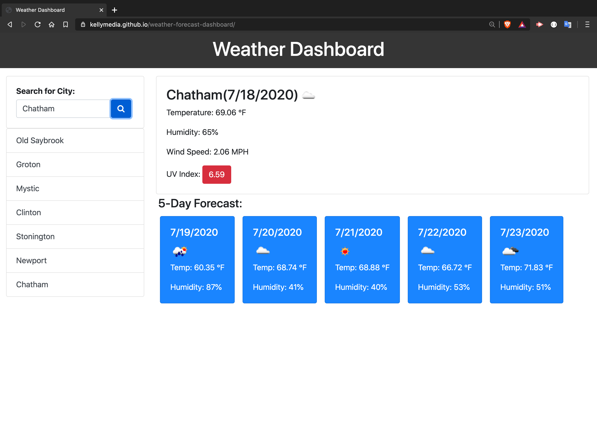

# Weather Forecast Dashboard

This app allows the user to search for current weather conditions by city names. The users search history is stored so that they can compare the different 5-day forecast efficiently. The current conditions are displayed at the top of the results, and the 5-day forecast is displayed below it. The conditions describe current temperature, humidity, wind speed, and UV index for each result. 

     

#Code Stack

JavaScript
AJAX
[Bootstrap](https://getbootstrap.com/)
[Moment.js](https://momentjs.com/)
[OpenWeather API](https://openweathermap.org/api)

## Demo

This image demonstrates the app functionality:

## Getting Started

Go to the https://kellymedia.github.io/weather-forecast-dashboard/ and search for any city. ☀️🏖😎

## Feedback

- Ask me a question on [Stack Overflow](https://stackoverflow.com/users/13296428/kellydotmedia)
- Follow [@kellydotmedia](https://twitter.com/kellydotmedia) and me us know what you think!

## License

Licensed under the [MIT](LICENSE.txt) license.