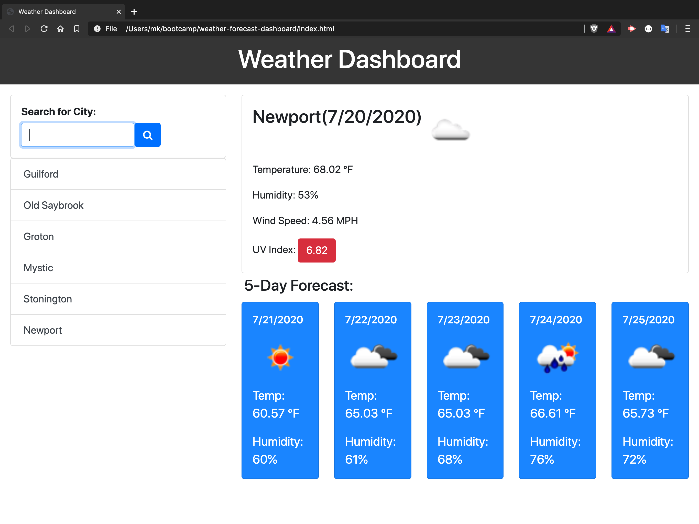

# Weather Forecast Dashboard

This app allows the user to search for current weather conditions by city names. The current conditions are displayed at the top of the results, and the 5-day forecast is displayed below it. The conditions describe current temperature, humidity, wind speed, and UV index for each result. 

If you were trying to plan a trip with multiple stops along the way, you could use this service to check the weather and prepare accordingly.

The user's search history is stored so that they can compare the different 5-day forecast efficiently.

  

## Code Stack

- JavaScript
- AJAX
- [Bootstrap](https://getbootstrap.com/)
- [Moment.js](https://momentjs.com/)
- [OpenWeather API](https://openweathermap.org/api)

## Demo

This image demonstrates the app functionality:

## Getting Started

Go to https://kellymedia.github.io/weather-forecast-dashboard/ to get the five day forecast for any city you search for. ☀️🏖😎

## Feedback

- Ask me a question on [Stack Overflow](https://stackoverflow.com/users/13296428/kellydotmedia)
- Follow [@kellydotmedia](https://twitter.com/kellydotmedia) and me me know what you think!

## License

Licensed under the [MIT](LICENSE.txt) license.